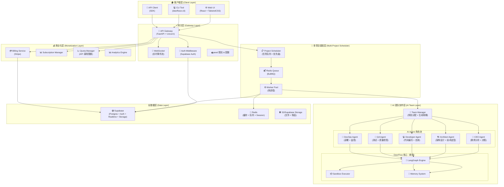
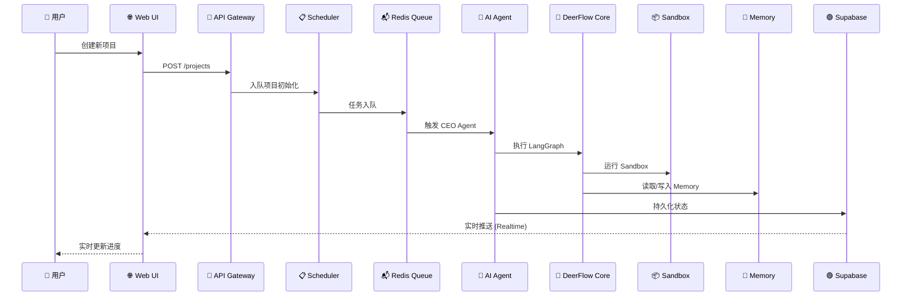
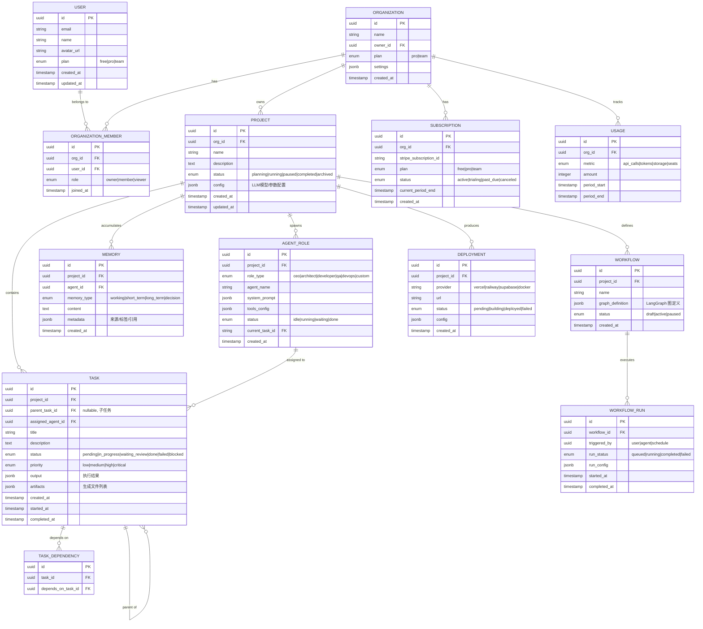

# DeerFlow-X 架构设计文档

> 版本：v0.1.0 | 状态：草稿 | 日期：2026-03-25
> 作者：DeerFlow-X 首席架构师

---

## 1. 概述

DeerFlow-X 是 DeerFlow 2.0 的商业化扩展产品，目标是在 LangGraph 多 Agent 工作流引擎之上，构建支持**多项目并行、AI 团队协作、按需商业化**的操作系统。

### 1.1 设计目标

| 目标维度 | 描述 |
|---|---|
| **多项目并行** | 单用户可同时运行多个独立项目，每项目有独立记忆、代码库、目标 |
| **AI 团队协作** | 多个角色 Agent（CEO/架构师/程序员/测试/运维）分工协作，模拟真实公司流程 |
| **商业化变现** | 内置订阅计费、用户管理、团队空间、Stripe 集成 |
| **快速部署** | 一键从需求到线上，支持 Vercel/Railway/Supabase 自动化部署链 |

### 1.2 核心设计原则

```
1. 继承优先：尽可能复用 DeerFlow 2.0 核心（LangGraph engine, sandbox, memory）
2. 分层解耦：核心引擎 / 调度层 / 协作层 / 商业层 四层分离
3. 数据库优先：所有状态持久化到 Supabase，避免内存丢失
4. API 先行：前后端通过 REST + WebSocket 通信，支持插件扩展
```

---

## 2. 系统架构图

### 2.1 整体分层架构（Mermaid）



### 2.2 数据流向图



---

## 3. 核心数据模型

### 3.1 ER 图



### 3.2 核心实体定义

#### 3.2.1 Organization（组织/团队空间）

```python
class Organization(BaseModel):
    id: UUID
    name: str                       # "我的独立工作室"
    owner_id: UUID                 # 所有者用户 ID
    plan: Literal["pro", "team"]   # 订阅等级
    settings: dict = {
        "default_llm": "gpt-4o",
        "max_agents": 5,
        "auto_deploy": True,
    }
    created_at: datetime
```

#### 3.2.2 Project（项目）

```python
class Project(BaseModel):
    id: UUID
    org_id: UUID
    name: str                      # "AI写作助手 SaaS"
    description: str
    status: ProjectStatus          # planning|running|paused|completed|archived
    config: ProjectConfig = {
        "llm": {
            "provider": "openai",
            "model": "gpt-4o",
            "temperature": 0.7,
        },
        "sandbox": {
            "type": "docker",
            "cpu": "2",
            "memory": "4Gi",
        },
        "auto_deploy": {
            "provider": "railway",
            "branch": "main",
        },
    }
    created_at: datetime
```

#### 3.2.3 AgentRole（AI 角色）

```python
class AgentRole(BaseModel):
    id: UUID
    project_id: UUID
    role_type: AgentRoleType       # ceo|architect|developer|qa|devops|custom
    agent_name: str                # "小王"，用户给 Agent 的昵称
    system_prompt: str             # 角色设定 Prompt
    tools_config: list[str]        # ["file_read", "code_write", "git", ...]
    status: AgentStatus            # idle|running|waiting|done
    current_task_id: UUID | None

    # 预设角色模板
    ROLE_TEMPLATES = {
        "ceo": {
            "description": "项目总负责，负责需求分析、任务拆解和进度把控",
            "tools": ["task_create", "task_assign", "progress_view", "decision_make"],
        },
        "architect": {
            "description": "技术架构师，负责系统设计、技术选型、代码审查",
            "tools": ["design_review", "code_review", "tech_decision"],
        },
        "developer": {
            "description": "全栈开发工程师，负责代码编写和自测",
            "tools": ["file_read", "file_write", "code_write", "git", "shell"],
        },
        "qa": {
            "description": "测试工程师，负责功能测试、回归测试、质量把控",
            "tools": ["test_write", "test_run", "bug_report"],
        },
        "devops": {
            "description": "运维工程师，负责部署、监控、自动化流水线",
            "tools": ["deploy", "monitor", "ci_cd", "log_view"],
        },
    }
```

#### 3.2.4 Task（任务）

```python
class Task(BaseModel):
    id: UUID
    project_id: UUID
    parent_task_id: UUID | None    # 可拆分子任务
    assigned_agent_id: UUID | None
    title: str                     # "实现用户登录功能"
    description: str                # 详细需求描述
    status: TaskStatus             # pending|in_progress|waiting_review|done|failed|blocked
    priority: Priority             # low|medium|high|critical
    output: dict | None            # 执行结果 JSON
    artifacts: list[str]           # ["src/auth/login.py", "tests/test_login.py"]
    created_at: datetime
    started_at: datetime | None
    completed_at: datetime | None
```

#### 3.2.5 Memory（记忆系统）

```python
class Memory(BaseModel):
    id: UUID
    project_id: UUID
    agent_id: UUID | None
    memory_type: MemoryType       # working|short_term|long_term|decision
    content: str                   # 记忆内容
    metadata: dict = {
        "tags": ["技术选型", "React"],
        "source": "architect_agent",
        "importance": 5,            # 1-10 重要性评分
    }
    created_at: datetime
```

#### 3.2.6 Subscription（订阅）

```python
class Subscription(BaseModel):
    id: UUID
    org_id: UUID
    stripe_subscription_id: str
    plan: Literal["free", "pro", "team"]
    status: SubscriptionStatus    # active|trialing|past_due|canceled
    current_period_end: datetime
    features: dict = {
        "pro": {
            "max_projects": 10,
            "max_agents_per_project": 5,
            "api_calls_per_month": 10000,
            "storage_gb": 5,
            "custom_llm": True,
        },
        "team": {
            "max_projects": 50,
            "max_agents_per_project": 10,
            "api_calls_per_month": 50000,
            "storage_gb": 50,
            "custom_llm": True,
            "team_members": 5,
        },
    }
```

---

## 4. 技术栈详解

### 4.1 技术选型矩阵

| 层次 | 技术选型 | 理由 |
|---|---|---|
| **核心引擎** | Python 3.12 + LangGraph 0.2+ | 继承 DeerFlow，最大化复用 |
| **API 网关** | FastAPI + Uvicorn | 高性能异步，自动 OpenAPI 文档 |
| **WebSocket** | FastAPI WebSocket + Supabase Realtime | 实时推送 Agent 进度 |
| **数据库** | Supabase Postgres | Auth + DB + Realtime 一体化 |
| **缓存/队列** | Redis + BullMQ | 任务队列、限流、Session |
| **前端** | React 18 + TypeScript + TailwindCSS + Shadcn | 快速构建，组件丰富 |
| **状态管理** | Zustand + React Query | 轻量 + 服务端状态 |
| **路由/布局** | React Router v6 + Tailwind Flex | SPA 路由 |
| **AI SDK** | LangChain + OpenAI SDK + Anthropic SDK | 多模型支持 |
| **沙箱执行** | Docker + e2b-sandbox | 代码安全执行 |
| **支付** | Stripe + Stripe Python | 订阅计费 |
| **文件存储** | Supabase Storage / S3 | 代码/制品存储 |
| **日志** | Structured JSON Logging + Supabase | 可搜索结构化日志 |
| **容器化** | Docker + Docker Compose | 开发/生产一致性 |

### 4.2 项目目录结构

```
deer-flow-x/
├── backend/
│   ├── app/
│   │   ├── api/
│   │   │   ├── v1/
│   │   │   │   ├── projects.py      # 项目 CRUD
│   │   │   │   ├── tasks.py         # 任务管理
│   │   │   │   ├── agents.py        # Agent 角色管理
│   │   │   │   ├── teams.py         # 团队协作
│   │   │   │   ├── memory.py        # 记忆系统
│   │   │   │   ├── billing.py       # 订阅计费
│   │   │   │   ├── deploy.py        # 部署管理
│   │   │   │   └── webhooks.py      # Stripe Webhooks
│   │   │   └── __init__.py
│   │   ├── core/
│   │   │   ├── config.py             # Pydantic Settings
│   │   │   ├── security.py          # Auth / JWT
│   │   │   └── exceptions.py         # 统一异常处理
│   │   ├── models/                   # SQLAlchemy Models
│   │   │   ├── user.py
│   │   │   ├── organization.py
│   │   │   ├── project.py
│   │   │   ├── task.py
│   │   │   ├── agent.py
│   │   │   ├── memory.py
│   │   │   └── subscription.py
│   │   ├── schemas/                  # Pydantic Schemas
│   │   │   ├── project.py
│   │   │   ├── task.py
│   │   │   └── ...
│   │   ├── services/
│   │   │   ├── scheduler.py          # 多项目调度器
│   │   │   ├── team_manager.py       # AI 团队管理器
│   │   │   ├── workflow_engine.py    # LangGraph 工作流引擎
│   │   │   ├── memory_service.py     # 记忆服务
│   │   │   ├── billing_service.py    # 计费服务
│   │   │   └── deploy_service.py     # 部署服务
│   │   ├── workers/
│   │   │   ├── agent_worker.py       # Agent 执行 Worker
│   │   │   ├── deploy_worker.py      # 部署 Worker
│   │   │   └── notification_worker.py
│   │   ├── agents/                   # AI Agent 实现
│   │   │   ├── base.py               # Base Agent
│   │   │   ├── ceo_agent.py
│   │   │   ├── architect_agent.py
│   │   │   ├── developer_agent.py
│   │   │   ├── qa_agent.py
│   │   │   ├── devops_agent.py
│   │   │   └── prompts/              # 各角色 Prompt 模板
│   │   ├── integrations/
│   │   │   ├── supabase.py           # Supabase 客户端
│   │   │   ├── stripe.py             # Stripe 集成
│   │   │   ├── sandbox.py            # e2b/Docker 沙箱
│   │   │   └── llm_providers.py      # 多 LLM 提供商
│   │   ├── main.py                   # FastAPI 应用入口
│   │   └── dependencies.py            # 依赖注入
│   ├── tests/
│   ├── scripts/
│   │   └── init_db.sql               # 数据库初始化脚本
│   ├── requirements.txt
│   ├── Dockerfile
│   └── docker-compose.yml
│
├── frontend/
│   ├── src/
│   │   ├── components/
│   │   │   ├── ui/                   # Shadcn UI 组件
│   │   │   ├── layout/               # 布局组件
│   │   │   │   ├── Sidebar.tsx
│   │   │   │   ├── Header.tsx
│   │   │   │   └── DashboardLayout.tsx
│   │   │   ├── project/              # 项目相关
│   │   │   ├── agent/                # Agent 相关
│   │   │   ├── task/                 # 任务相关
│   │   │   └── billing/              # 商业化相关
│   │   ├── pages/
│   │   │   ├── Dashboard.tsx         # 总览仪表盘
│   │   │   ├── Projects.tsx          # 项目列表
│   │   │   ├── ProjectDetail.tsx     # 项目详情
│   │   │   ├── AgentChat.tsx         # Agent 对话
│   │   │   ├── TeamView.tsx          # 团队视图
│   │   │   ├── Settings.tsx          # 设置
│   │   │   └── Pricing.tsx           # 定价页
│   │   ├── hooks/
│   │   │   ├── useProjects.ts
│   │   │   ├── useTasks.ts
│   │   │   ├── useAgents.ts
│   │   │   └── useSubscription.ts
│   │   ├── stores/
│   │   │   ├── projectStore.ts
│   │   │   └── agentStore.ts
│   │   ├── lib/
│   │   │   ├── supabase.ts           # Supabase 客户端
│   │   │   └── api.ts                # API 客户端
│   │   ├── App.tsx
│   │   └── main.tsx
│   ├── package.json
│   ├── tailwind.config.ts
│   ├── vite.config.ts
│   └── Dockerfile
│
├── sandbox/
│   ├── Dockerfile                     # 沙箱执行环境
│   ├── entrypoint.sh
│   └── examples/
│       └── python/
│
├── infra/
│   ├── railway/                       # Railway 部署配置
│   ├── supabase/
│   │   └── migrations/               # 数据库迁移
│   └── nginx/
│       └── nginx.conf
│
├── docs/
│   ├── ARCHITECTURE.md
│   ├── API.md
│   ├── AGENT_PROMPTS.md
│   └── DEPLOY.md
│
├── .env.example
├── README.md
└── LICENSE
```

---

## 5. 数据库 Schema（Supabase Postgres）

```sql
-- ============================================================
-- DeerFlow-X Database Schema
-- Supabase Postgres + Auth + Realtime + Storage
-- ============================================================

-- 启用扩展
CREATE EXTENSION IF NOT EXISTS "uuid-ossp";

-- ============================================================
-- 组织 / 团队空间
-- ============================================================
CREATE TABLE organizations (
    id UUID PRIMARY KEY DEFAULT uuid_generate_v4(),
    name TEXT NOT NULL,
    owner_id UUID REFERENCES auth.users(id) ON DELETE CASCADE,
    plan TEXT NOT NULL DEFAULT 'free' CHECK (plan IN ('free', 'pro', 'team')),
    settings JSONB DEFAULT '{}',
    created_at TIMESTAMPTZ DEFAULT NOW(),
    updated_at TIMESTAMPTZ DEFAULT NOW()
);

-- 组织成员
CREATE TABLE organization_members (
    id UUID PRIMARY KEY DEFAULT uuid_generate_v4(),
    org_id UUID REFERENCES organizations(id) ON DELETE CASCADE,
    user_id UUID REFERENCES auth.users(id) ON DELETE CASCADE,
    role TEXT NOT NULL DEFAULT 'member' CHECK (role IN ('owner', 'member', 'viewer')),
    joined_at TIMESTAMPTZ DEFAULT NOW(),
    UNIQUE(org_id, user_id)
);

-- ============================================================
-- 项目
-- ============================================================
CREATE TABLE projects (
    id UUID PRIMARY KEY DEFAULT uuid_generate_v4(),
    org_id UUID REFERENCES organizations(id) ON DELETE CASCADE,
    name TEXT NOT NULL,
    description TEXT,
    status TEXT NOT NULL DEFAULT 'planning'
        CHECK (status IN ('planning', 'running', 'paused', 'completed', 'archived')),
    config JSONB DEFAULT '{}',
    created_at TIMESTAMPTZ DEFAULT NOW(),
    updated_at TIMESTAMPTZ DEFAULT NOW()
);

CREATE INDEX idx_projects_org_id ON projects(org_id);
CREATE INDEX idx_projects_status ON projects(status);

-- ============================================================
-- Agent 角色
-- ============================================================
CREATE TABLE agent_roles (
    id UUID PRIMARY KEY DEFAULT uuid_generate_v4(),
    project_id UUID REFERENCES projects(id) ON DELETE CASCADE,
    role_type TEXT NOT NULL
        CHECK (role_type IN ('ceo', 'architect', 'developer', 'qa', 'devops', 'custom')),
    agent_name TEXT NOT NULL,
    system_prompt TEXT,
    tools_config JSONB DEFAULT '[]',
    status TEXT NOT NULL DEFAULT 'idle'
        CHECK (status IN ('idle', 'running', 'waiting', 'done')),
    current_task_id UUID,
    created_at TIMESTAMPTZ DEFAULT NOW(),
    updated_at TIMESTAMPTZ DEFAULT NOW()
);

CREATE INDEX idx_agent_roles_project_id ON agent_roles(project_id);

-- ============================================================
-- 任务
-- ============================================================
CREATE TABLE tasks (
    id UUID PRIMARY KEY DEFAULT uuid_generate_v4(),
    project_id UUID REFERENCES projects(id) ON DELETE CASCADE,
    parent_task_id UUID REFERENCES tasks(id) ON DELETE SET NULL,
    assigned_agent_id UUID REFERENCES agent_roles(id) ON DELETE SET NULL,
    title TEXT NOT NULL,
    description TEXT,
    status TEXT NOT NULL DEFAULT 'pending'
        CHECK (status IN ('pending', 'in_progress', 'waiting_review', 'done', 'failed', 'blocked')),
    priority TEXT NOT NULL DEFAULT 'medium'
        CHECK (priority IN ('low', 'medium', 'high', 'critical')),
    output JSONB DEFAULT '{}',
    artifacts JSONB DEFAULT '[]',
    created_at TIMESTAMPTZ DEFAULT NOW(),
    started_at TIMESTAMPTZ,
    completed_at TIMESTAMPTZ
);

CREATE INDEX idx_tasks_project_id ON tasks(project_id);
CREATE INDEX idx_tasks_assigned_agent_id ON tasks(assigned_agent_id);
CREATE INDEX idx_tasks_status ON tasks(status);

-- 添加外键到 agent_roles.current_task_id
ALTER TABLE agent_roles
    ADD CONSTRAINT fk_agent_current_task
    FOREIGN KEY (current_task_id) REFERENCES tasks(id) ON DELETE SET NULL;

-- 任务依赖
CREATE TABLE task_dependencies (
    id UUID PRIMARY KEY DEFAULT uuid_generate_v4(),
    task_id UUID REFERENCES tasks(id) ON DELETE CASCADE,
    depends_on_task_id UUID REFERENCES tasks(id) ON DELETE CASCADE,
    UNIQUE(task_id, depends_on_task_id)
);

-- ============================================================
-- 记忆系统
-- ============================================================
CREATE TABLE memories (
    id UUID PRIMARY KEY DEFAULT uuid_generate_v4(),
    project_id UUID REFERENCES projects(id) ON DELETE CASCADE,
    agent_id UUID REFERENCES agent_roles(id) ON DELETE SET NULL,
    memory_type TEXT NOT NULL
        CHECK (memory_type IN ('working', 'short_term', 'long_term', 'decision')),
    content TEXT NOT NULL,
    metadata JSONB DEFAULT '{}',
    created_at TIMESTAMPTZ DEFAULT NOW()
);

CREATE INDEX idx_memories_project_id ON memories(project_id);
CREATE INDEX idx_memories_agent_id ON memories(agent_id);
CREATE INDEX idx_memories_type ON memories(memory_type);

-- ============================================================
-- 工作流
-- ============================================================
CREATE TABLE workflows (
    id UUID PRIMARY KEY DEFAULT uuid_generate_v4(),
    project_id UUID REFERENCES projects(id) ON DELETE CASCADE,
    name TEXT NOT NULL,
    graph_definition JSONB NOT NULL,
    status TEXT NOT NULL DEFAULT 'draft'
        CHECK (status IN ('draft', 'active', 'paused')),
    created_at TIMESTAMPTZ DEFAULT NOW(),
    updated_at TIMESTAMPTZ DEFAULT NOW()
);

CREATE TABLE workflow_runs (
    id UUID PRIMARY KEY DEFAULT uuid_generate_v4(),
    workflow_id UUID REFERENCES workflows(id) ON DELETE CASCADE,
    triggered_by TEXT DEFAULT 'user',
    run_status TEXT NOT NULL DEFAULT 'queued'
        CHECK (run_status IN ('queued', 'running', 'completed', 'failed')),
    run_config JSONB DEFAULT '{}',
    started_at TIMESTAMPTZ DEFAULT NOW(),
    completed_at TIMESTAMPTZ
);

CREATE INDEX idx_workflow_runs_workflow_id ON workflow_runs(workflow_id);

-- ============================================================
-- 订阅 & 计费
-- ============================================================
CREATE TABLE subscriptions (
    id UUID PRIMARY KEY DEFAULT uuid_generate_v4(),
    org_id UUID REFERENCES organizations(id) ON DELETE CASCADE,
    stripe_subscription_id TEXT UNIQUE,
    plan TEXT NOT NULL CHECK (plan IN ('free', 'pro', 'team')),
    status TEXT NOT NULL DEFAULT 'active'
        CHECK (status IN ('active', 'trialing', 'past_due', 'canceled')),
    current_period_end TIMESTAMPTZ,
    created_at TIMESTAMPTZ DEFAULT NOW()
);

-- 用量追踪
CREATE TABLE usage_records (
    id UUID PRIMARY KEY DEFAULT uuid_generate_v4(),
    org_id UUID REFERENCES organizations(id) ON DELETE CASCADE,
    metric TEXT NOT NULL,
    amount INTEGER NOT NULL DEFAULT 0,
    period_start TIMESTAMPTZ NOT NULL,
    period_end TIMESTAMPTZ NOT NULL,
    created_at TIMESTAMPTZ DEFAULT NOW()
);

CREATE INDEX idx_usage_org_id ON usage_records(org_id);
CREATE INDEX idx_usage_period ON usage_records(org_id, period_start, period_end);

-- ============================================================
-- 部署记录
-- ============================================================
CREATE TABLE deployments (
    id UUID PRIMARY KEY DEFAULT uuid_generate_v4(),
    project_id UUID REFERENCES projects(id) ON DELETE CASCADE,
    provider TEXT NOT NULL CHECK (provider IN ('vercel', 'railway', 'supabase', 'docker')),
    url TEXT,
    status TEXT NOT NULL DEFAULT 'pending'
        CHECK (status IN ('pending', 'building', 'deployed', 'failed')),
    config JSONB DEFAULT '{}',
    created_at TIMESTAMPTZ DEFAULT NOW()
);

CREATE INDEX idx_deployments_project_id ON deployments(project_id);

-- ============================================================
-- RLS 策略（Row Level Security）
-- ============================================================

-- 组织：成员可见
ALTER TABLE organizations ENABLE ROW LEVEL SECURITY;
CREATE POLICY "org_members_view" ON organizations FOR SELECT
    USING (id IN (SELECT org_id FROM organization_members WHERE user_id = auth.uid()));

-- 项目：组织成员可见
ALTER TABLE projects ENABLE ROW LEVEL SECURITY;
CREATE POLICY "project_org_view" ON projects FOR ALL
    USING (org_id IN (SELECT org_id FROM organization_members WHERE user_id = auth.uid()));

-- 任务：项目成员可见
ALTER TABLE tasks ENABLE ROW LEVEL SECURITY;
CREATE POLICY "task_project_view" ON tasks FOR ALL
    USING (
        project_id IN (
            SELECT p.id FROM projects p
            JOIN organization_members om ON om.org_id = p.org_id
            WHERE om.user_id = auth.uid()
        )
    );

-- Agent：项目成员可见
ALTER TABLE agent_roles ENABLE ROW LEVEL SECURITY;
CREATE POLICY "agent_project_view" ON agent_roles FOR ALL
    USING (
        project_id IN (
            SELECT p.id FROM projects p
            JOIN organization_members om ON om.org_id = p.org_id
            WHERE om.user_id = auth.uid()
        )
    );

-- ============================================================
-- Realtime 订阅
-- ============================================================
ALTER PUBLICATION supabase_realtime ADD TABLE tasks;
ALTER PUBLICATION supabase_realtime ADD TABLE agent_roles;
ALTER PUBLICATION supabase_realtime ADD TABLE projects;
```

---

## 6. API 设计

### 6.1 REST API 概览

```
认证: Bearer Token (Supabase JWT)
Base URL: /api/v1

Organizations
  POST   /orgs                        创建组织
  GET    /orgs                        列出我的组织
  GET    /orgs/:id                    获取组织详情
  PATCH  /orgs/:id                    更新组织
  DELETE /orgs/:id                    删除组织
  POST   /orgs/:id/members           添加成员
  DELETE /orgs/:id/members/:userId   移除成员

Projects
  POST   /orgs/:orgId/projects       创建项目
  GET    /orgs/:orgId/projects       列出项目
  GET    /projects/:id                获取项目详情
  PATCH  /projects/:id                更新项目
  DELETE /projects/:id                删除项目
  POST   /projects/:id/start          启动项目
  POST   /projects/:id/pause          暂停项目

Agents
  POST   /projects/:id/agents         创建 Agent 角色
  GET    /projects/:id/agents        列出 Agent
  PATCH  /agents/:id                  更新 Agent
  DELETE /agents/:id                  删除 Agent
  POST   /agents/:id/chat             与 Agent 对话
  GET    /agents/:id/memory           读取 Agent 记忆

Tasks
  POST   /projects/:id/tasks          创建任务
  GET    /projects/:id/tasks          列出任务
  GET    /tasks/:id                    获取任务详情
  PATCH  /tasks/:id                    更新任务
  POST   /tasks/:id/complete           标记完成
  POST   /tasks/:id/fail               标记失败

Workflows
  POST   /projects/:id/workflows      创建工作流
  GET    /projects/:id/workflows      列出工作流
  POST   /workflows/:id/run            执行工作流
  GET    /workflows/:id/runs           历史运行记录

Memory
  GET    /projects/:id/memories       搜索项目记忆
  POST   /projects/:id/memories        写入记忆
  DELETE /memories/:id                  删除记忆

Billing
  GET    /orgs/:id/subscription        获取订阅信息
  POST   /orgs/:id/subscription         创建/更新订阅
  GET    /orgs/:id/usage                获取用量
  POST   /billing/portal                Stripe Portal

Webhooks
  POST   /webhooks/stripe              Stripe Webhook
```

### 6.2 WebSocket 事件

```typescript
// 客户端订阅
const supabase = createClient(SUPABASE_URL, SUPABASE_ANON_KEY)
supabase.channel('project_events')
  .on('postgres_changes', { 
    event: '*', 
    schema: 'public', 
    table: 'tasks',
    filter: `project_id=eq.${projectId}`
  }, handleTaskChange)
  .on('postgres_changes', {
    event: '*',
    schema: 'public',
    table: 'agent_roles',
    filter: `project_id=eq.${projectId}`
  }, handleAgentChange)
  .subscribe()
```

---

## 7. 核心服务详解

### 7.1 多项目调度器（Scheduler）

```python
# services/scheduler.py
"""
多项目调度器：负责任务入队、优先级排序、多 Worker 分配
"""
from typing import Protocol
from enum import Enum
import asyncio
from datetime import datetime

class TaskPriority(Enum):
    LOW = 0
    MEDIUM = 5
    HIGH = 8
    CRITICAL = 10

class ProjectScheduler:
    """
    核心调度逻辑：
    1. 接收任务请求（来自 API 或 Agent）
    2. 按项目 + 优先级入队
    3. 分配给对应项目的 Worker
    4. 监控 Worker 健康状态
    """

    def __init__(self, redis_url: str, max_concurrent_projects: int = 10):
        self.queue = RedisQueue(redis_url, "deerflowx:tasks")
        self.max_concurrent = max_concurrent_projects
        self.active_projects: dict[UUID, ProjectState] = {}

    async def enqueue_task(self, task: Task, project_id: UUID) -> str:
        """将任务加入调度队列"""
        priority = TaskPriority[task.priority.upper()].value
        
        payload = {
            "task_id": str(task.id),
            "project_id": str(project_id),
            "priority": priority,
            "enqueued_at": datetime.utcnow().isoformat(),
            "retry_count": 0,
        }
        
        job_id = await self.queue.enqueue(
            "agent_worker.process_task",
            payload,
            job_id=str(task.id),
            priority=priority,
        )
        
        return job_id

    async def get_next_tasks(self, limit: int = 5) -> list[Task]:
        """获取下一个待执行的任务（按优先级）"""
        ...
```

### 7.2 AI 团队管理器（